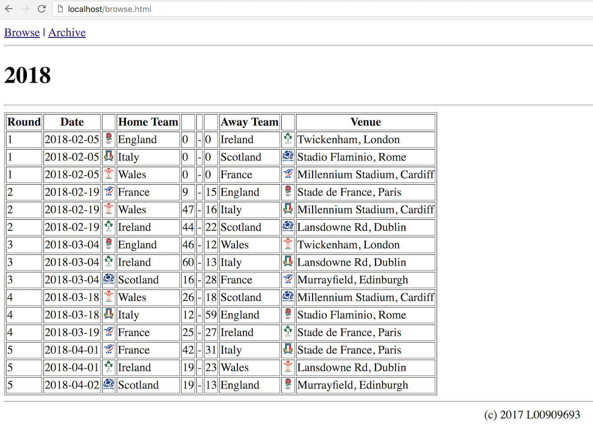
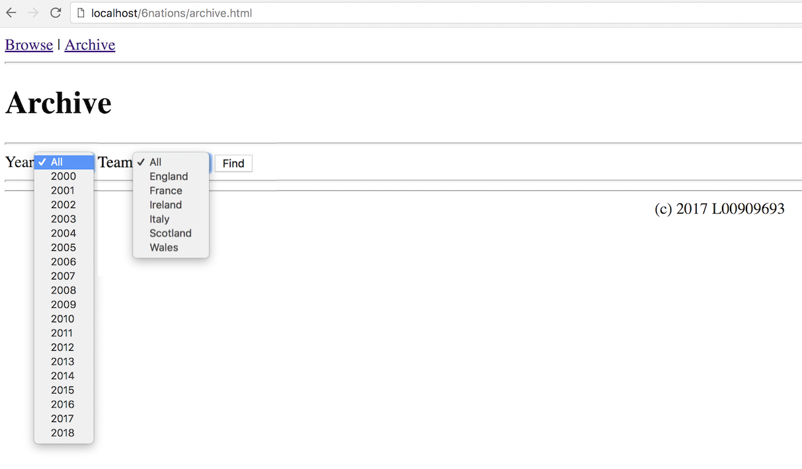

# jQuery Exercise 5 – 6 Nations

## Fetch latest Repository Branch

```
$ cd /DRIVE/xampp/htdocs/jQuery
$ git pull --no-edit https://github.com/noucampdotorgSSAD/jQuery.git latest
$ git status

```

Setup the [6nations](../6nations/6nationsDB.sql) database on your MySQL server.


# Part 1 – Browse



1.	Examine the code in [http://localhost/jQuery/6nations/browse.html](http://localhost/jQuery/6nations/browse.html). 

1.	Modify the code in ``6nations/browse.js`` to display the output shown in the image above.  Only use jQuery code in the JavaScript file.

1.	Push your code to **your private** repository on GitHub.  Type these commands into your *Git Bash* client:

	```
	$ git status
	$ git add .
	$ git commit -m "Exercise 5 - Part 1 DONE|PARTIAL|HELP"
	$ git push origin master
	$ git status

	```

# Part 2 – Archive



1.	Examine the code in [http://localhost/jQuery/6nations/archive.html](http://localhost/jQuery/6nations/archive.html). 

1.	Modify the code in ``6nations/archive.js`` to display the output shown in the image above.  Only use jQuery code in the JavaScript file.


1.	Push your code to **your private** repository on GitHub.  Type these commands into your *Git Bash* client:

	```
	$ git status
	$ git add .
	$ git commit -m "Exercise 5 - Part 2 DONE|PARTIAL|HELP"
	$ git push origin master
	$ git status

	```

